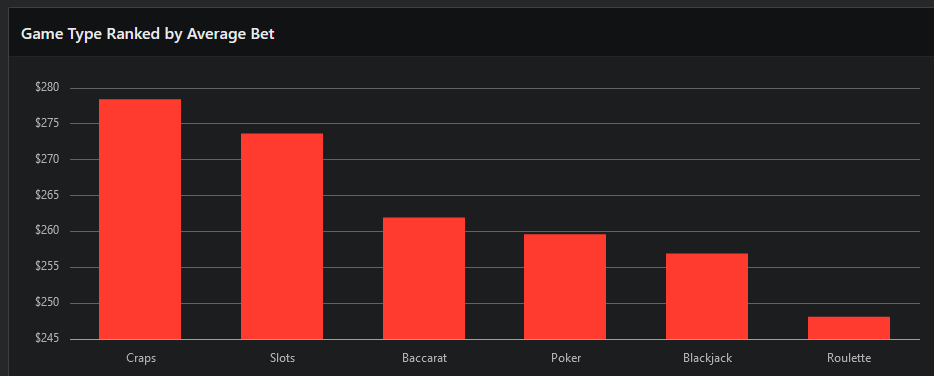
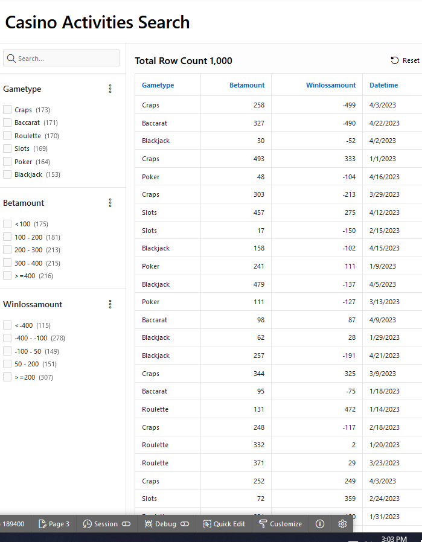
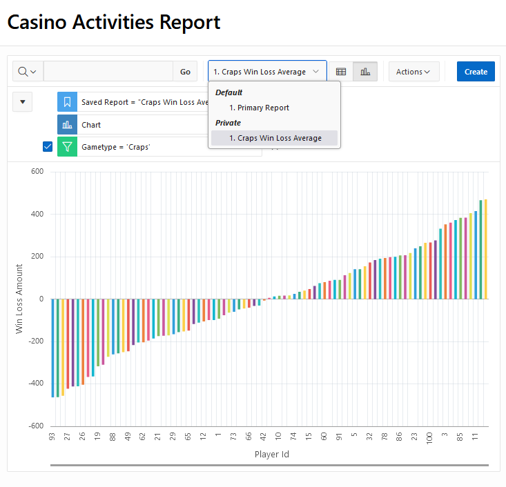

# Oracle APEX Casino Activity Dashboard

## Table of Contents
- [Overview](#overview)
- [Dashboard Visualizations](#dashboard-visualizations)
  - [Average Bet by Game Type](#average-bet-by-game-type)
  - [Monthly Casino Revenue](#monthly-casino-revenue)
  - [Top Frequent Player Nets](#top-frequent-player-nets)
- [SQL Queries](#sql-queries)
- [JavaScript Code](#javascript-code)
- [Diagnostic Script](#diagnostic-script)
- [Additional Reports](#additional-reports)

## Overview

Data displayed was generated via python script locally.

This document showcases the Oracle APEX application, a key software solution designed to visualize and analyze various activities within a casino setting. The application serves as a testament to the Application Engineer's role in advancing the Global Casino Team’s objectives of increasing process automation, operational efficiency, and effectiveness. By providing a graphical representation of data related to game types, monthly revenue, and player statistics, the dashboard aligns seamlessly with the essential functions of the role. 

*Figure 1: Main Dashboard Visualizing Casino Activities*


## Dashboard Visualizations

### Average Bet by Game Type

*Figure 2: Bar chart displaying the average bet amount by game type.*



### Monthly Casino Revenue

*Figure 3: Line graph showing the monthly revenue trend.*


### Top Frequent Player Nets

*Figure 4: Bar chart of the top frequent players' net winnings.*


## SQL Queries

#### Query for Average Bet by Game Type

```sql
SELECT
  "GAMETYPE",
  AVG("BETAMOUNT") AS "AVERAGE_BET"
FROM
  CASINO_ACTIVITY
GROUP BY
  "GAMETYPE"
ORDER BY
  AVG("BETAMOUNT") DESC;
```

#### Query for Monthly Casino Revenue

```sql
SELECT
  TO_CHAR(TRUNC(TO_DATE("DATETIME", 'MM/DD/YYYY')), 'YYYY-MM') AS "MONTH",
  -SUM("WINLOSSAMOUNT") AS "MONTHLY_REVENUE"
FROM
  CASINO_ACTIVITY
GROUP BY
  TO_CHAR(TRUNC(TO_DATE("DATETIME", 'MM/DD/YYYY')), 'YYYY-MM')
ORDER BY
  "MONTH" ASC;
```

#### Query for Top Frequent Player Nets

```sql
SELECT
  "PLAYERID",
  COUNT("PLAYERID") AS "Frequency",
  SUM("WINLOSSAMOUNT") AS "Total_Winnings"
FROM
  CASINO_ACTIVITY
GROUP BY
  "PLAYERID"
ORDER BY
  "Frequency" DESC
FETCH FIRST 10 ROWS ONLY;
```


## JavaScript Code

The JavaScript snippet below is utilized to enhance the chart's interactivity by appending a ranking to player IDs.

```javascript
// Ensure this runs after the chart is fully rendered
apex.jQuery(function($) {
  // Target the chart container by its Static ID
  var chartContainerId = 'R45844629039383693872_jet';

  // Find all text elements within the chart container
  var textElements = $('#' + chartContainerId + ' text');

  // Loop through each text element starting from index 10 and prepend the ranking
  textElements.each(function(index) {
    if (index >= 10) { // Assuming index 10 and onwards are the Player IDs
      var currentText = $(this).text();
      var newText = '#' + (index - 9) + ' ' + currentText; // index - 9 to start counting from 1
      $(this).text(newText);
    }
  });
});
```


#### Diagnostic Script
For debugging purposes, this script can be run to extract information from the chart's text elements, providing valuable insights for developers.

```javascript
// Diagnostic script to log information about the chart's text elements
var chartContainer = document.querySelector('#ENTERCONTAINERIDHERE');
if (chartContainer) {
  console.log('Chart container found:', chartContainer);

  var textElements = chartContainer.querySelectorAll('text');
  console.log('Number of text elements in the chart:', textElements.length);

  textElements.forEach(function(text, index) {
    console.log(`Text element ${index}:`, text.textContent, ' - ID:', text.id);
  });
} else {
  console.log('Chart container not found.');
}
```


## Additional Reports

Figure 5: An additional report showcasing various player statistics.




Figure 6: A detailed report on different casino game activities.


